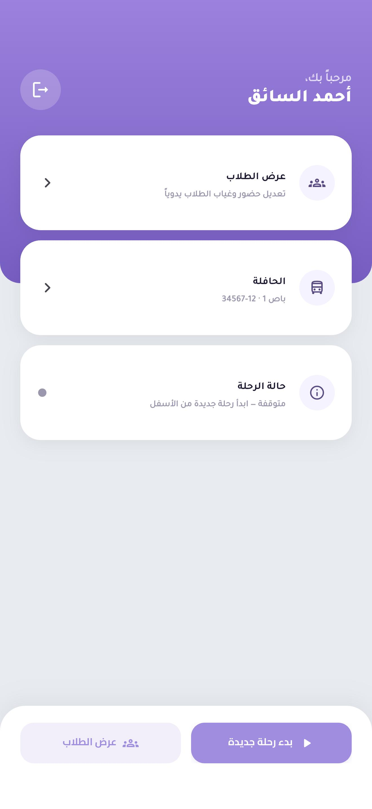

# 🚍 Live Bus

[](https://flutter.dev)
[](https://laravel.com)
[](https://firebase.google.com)
[](https://mysql.com)
[](#-architecture)

## 🚀 Complete School & Kindergarten Management Platform

**Live Bus** is a modern SaaS platform designed to help schools and kindergartens manage their daily operations from one connected system.

It combines:

- Student management
- Attendance tracking
- Financial management
- Parent communication
- Bus management
- Real-time transportation tracking

> **Not just bus tracking — a complete operating system for schools and kindergartens.**

🌐 **Website:** [https://livebus.site](https://livebus.site)

---

# 📌 Overview

Schools usually manage transportation, attendance, finance, and communication using multiple disconnected tools.

Live Bus brings everything together into one platform connecting:

🏫 School Administration  
🚌 Drivers  
👨‍👩‍👧 Parents  
🎓 Students  

The platform provides a complete workflow from student registration to safe transportation arrival.

---

## Why Live Bus?

Unlike traditional GPS tracking apps, Live Bus combines:

✅ School Administration  
✅ Student Management  
✅ Finance  
✅ Attendance  
✅ Real-time Transportation  
✅ Parent Communication  
✅ Multi-Tenant SaaS  

All within one scalable platform.

---

# ✨ Main Features

## 🏫 School Administration

Complete management dashboard including:

- Student management
- Parent accounts
- Classes management
- Attendance monitoring
- Bus management
- Driver management
- Announcements
- Financial operations
- Reports and insights

---

## 🎓 Student Management

Manage the complete student lifecycle:

- Student profiles
- Parent linking
- Class assignment
- Bus assignment
- QR student cards
- Attendance history
- Financial records

---

## 🚌 Smart Transportation System

Live Bus provides intelligent school transportation management:

- Real-time bus tracking
- Live trip monitoring
- Driver management
- Bus assignments
- Student transportation subscriptions
- Route management
- Parent notifications

---

## 📍 Real-Time GPS Tracking

Parents and administrators can monitor active trips through real-time location updates.

**Flow:**

```
Driver Application
        ↓
Real-Time Location System
        ↓
Parent & Admin Applications
```

**Benefits:**

- Live bus visibility
- Better safety
- Reduced waiting time
- Improved communication

---

## 👨‍👩‍👧 Parent Application

Parents can:

- View children
- Track buses live
- Receive notifications
- Check attendance
- View announcements
- Follow financial information
- Manage home location

---

## 🧑‍✈️ Driver Application

Drivers can:

- Start and manage trips
- Share live location
- View assigned students
- Record attendance
- Scan student QR codes
- View required trip information

---

# 💰 Finance Management

A complete school finance system:

**Features:**

- Fees management
- Student invoices
- Payments tracking
- Receipts
- Discounts
- Transportation subscriptions
- Financial summaries

---

# 🏢 SaaS Architecture

Live Bus is built as a multi-tenant SaaS platform.

Each organization has:

- Independent data
- Own users
- Own students
- Own buses
- Own financial records
- Own settings

The platform supports:

- Organizations
- Subscription plans
- Account management
- SaaS operations

---

# 🛠 Technology Stack

## 📱 Mobile Development

- Flutter
- Dart

## ⚙️ Backend Development

- Laravel
- PHP
- REST APIs

## 🗄 Database

- MySQL
- SQL Database Design

## 🔥 Real-Time & Cloud

- Firebase Realtime Database
- Firebase Cloud Messaging

## 🗺 Maps & Location

- HERE Maps
- Routing Services

## 🔧 Tools

- Git
- GitHub Actions
- Docker
- Linux

---

# 🏗 Architecture

```
             Flutter Applications

    Parent App | Driver App | Admin App

                     |
                     |
               Laravel Backend

    Authentication - Business Logic - APIs

                     |
          -------------------------
          |                       |
       MySQL              Firebase Realtime
    Main Data              Live Tracking
```

For a deeper technical breakdown, see **[docs/SYSTEM_ARCHITECTURE.md](docs/SYSTEM_ARCHITECTURE.md)**.

---

# 👥 User Roles

## Super Admin

Platform management:

- Manage organizations
- Manage subscriptions
- Monitor SaaS operations

## School Admin

Organization management:

- Students
- Parents
- Classes
- Attendance
- Finance
- Transportation

## Driver

Transportation operations:

- Trips
- GPS tracking
- Student attendance

## Parent

Family experience:

- Child tracking
- Notifications
- Attendance
- Financial information

---

# 📸 Screenshots

## Parent App


---

## Driver App



---

## Admin Dashboard


---

# 🚀 Project Highlights

✅ Complete SaaS Architecture  
✅ Real-Time GPS Tracking  
✅ Multi-Role Applications  
✅ School Management System  
✅ Finance Module  
✅ Attendance System  
✅ Push Notifications  
✅ Mobile + Web Experience  
✅ Scalable Backend Architecture  

---

# 🔮 Roadmap

Future improvements:

- Advanced analytics
- AI route optimization
- More automation
- Smart transportation insights
- Additional school management features

---

## 👨‍💻 Author

**Amer Riad**

Full Stack Developer

🌐 **Website**  
[https://livebus.site](https://livebus.site)

💼 **LinkedIn**  
[https://linkedin.com/in/amer-riad-73a67b277](https://linkedin.com/in/amer-riad-73a67b277)

📸 **Instagram**  
[https://instagram.com/amer._.riad0](https://instagram.com/amer._.riad0)

---

⭐ If you enjoyed this project, consider giving it a star.
