<div align="center">


# EduOne

**Complete School & Kindergarten Management System**

One integrated platform for student management, smart transportation, attendance, academics, finance, and parent communication.

[](https://flutter.dev)
[](https://laravel.com)
[](https://firebase.google.com)
[](https://mysql.com)
[](https://www.here.com)

[Website](https://eduone.site) · [Product Overview](docs/PRODUCT_OVERVIEW.md) · [Architecture](docs/SYSTEM_ARCHITECTURE.md)

</div>

---

## About EduOne

EduOne is a complete school and kindergarten management system that helps educational institutions manage daily operations through one integrated digital platform:

- Student Management
- Smart School Transportation
- Attendance Management
- Parent Communication
- Financial Management
- Academic System
- Teacher and Timetable Management

Instead of Excel files, scattered chat groups, and separate systems, EduOne connects school administrators, teachers, drivers, and parents in one easy-to-use environment.

> **Not just bus tracking — a complete digital operating system for schools and kindergartens.**

---

## How EduOne Works

Each educational institution gets:

- A dedicated management system
- A complete administration dashboard
- Apps based on user permissions
- Organized student and teacher data
- Educational and administrative operation management
- Data security and protection

### System Users

| Role | Access |
|------|--------|
| **School Administration** | Full dashboard to manage departments and daily operations |
| **Teachers** | Grades, assignments, notes, schedules, and class reports |
| **Drivers** | Trips, live GPS, student list, and QR attendance |
| **Parents** | Children profiles, live bus tracking, attendance, grades, and finance |

---

## Screenshots

### Administration Dashboard

<p align="center">
  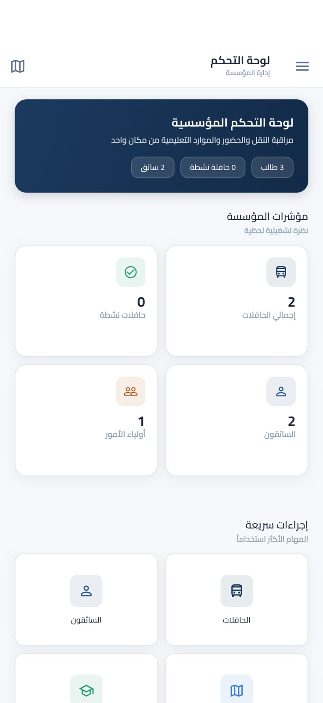
  &nbsp;
  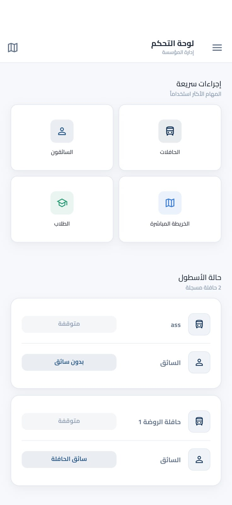
  &nbsp;
  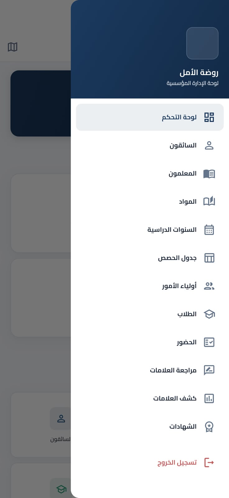
  &nbsp;
  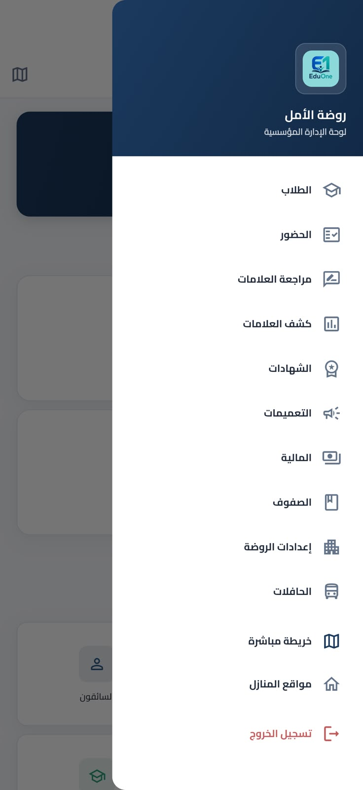
</p>

### Teacher Application

<p align="center">
  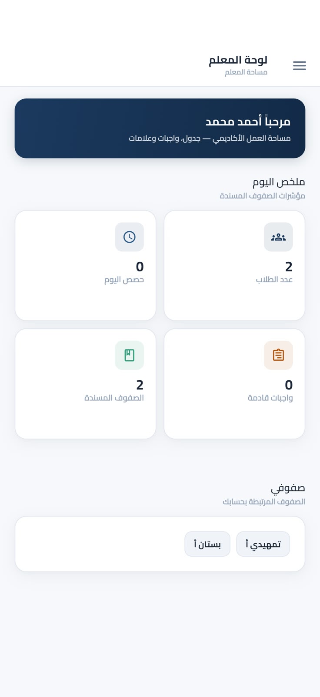
  &nbsp;
  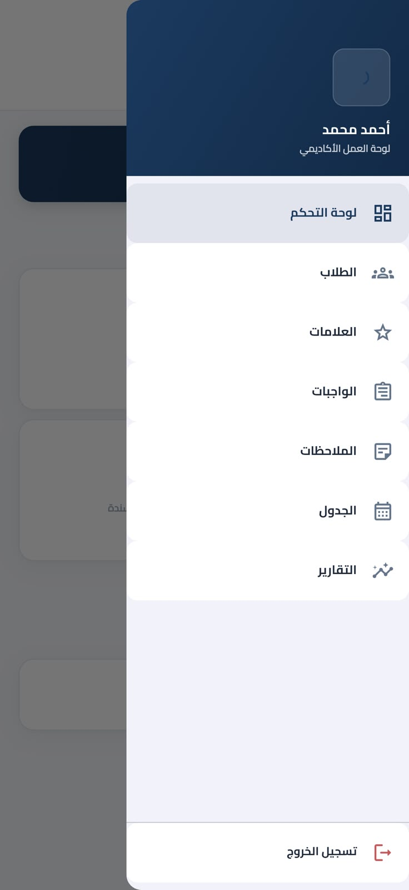
</p>

### Parent Application

<p align="center">
  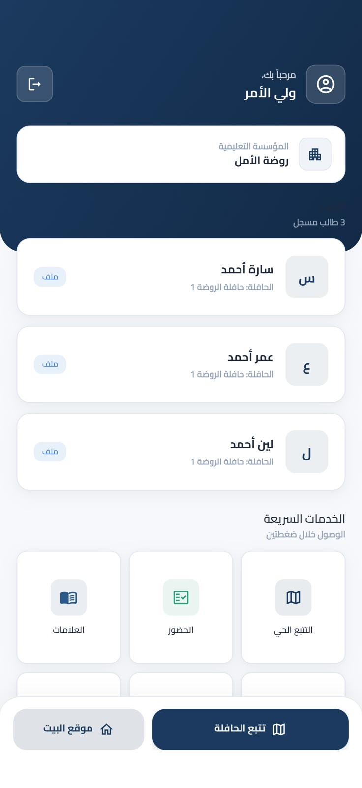
  &nbsp;
  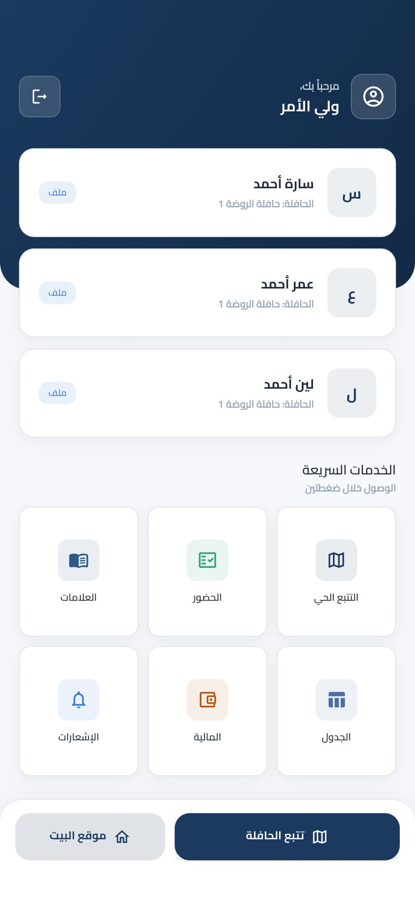
</p>

### Driver Application

<p align="center">
  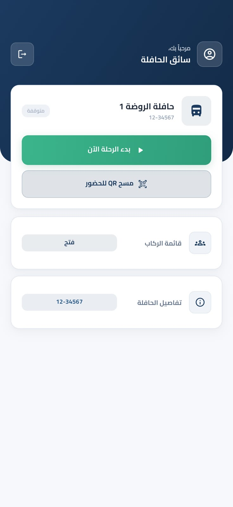
  &nbsp;
  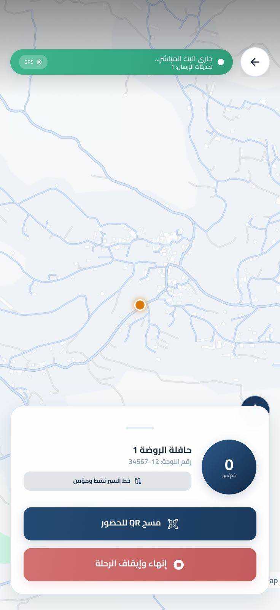
  &nbsp;
  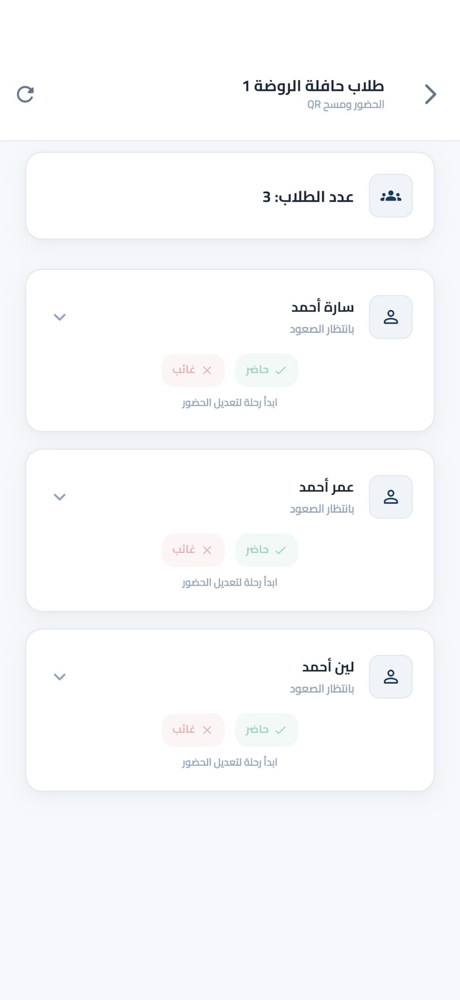
</p>

---

## School Administration

### Dashboard

The administration dashboard provides:

- Number of students, teachers, parents, and buses
- Currently active buses
- Operational statistics
- Live transportation tracking on the map

### Student Management

- Add, edit, and archive students
- Link students with parents
- Assign classes, sections, and buses
- Create student QR cards
- Manage the complete student profile

**Student profile includes:** basic information, attendance records, transportation info, financial records, grades, and academic reports.

### Parent Management

- Create parent accounts
- Link multiple students to one account
- Send announcements
- View financial information
- Follow academic progress

### Teacher Management

- Add and manage teachers
- Assign subjects and link teachers with classes
- Manage schedules
- Monitor academic performance

### Classes and Sections

- Create classes and sections
- Distribute students
- Assign teachers to classes
- Manage academic years

---

## Smart School Transportation

### Bus Management

- Add and edit buses
- Assign drivers
- Manage bus status
- View live bus locations

### Live GPS Tracking

When the driver starts a trip, location is sent in real time. Administration and parents can:

- View the bus on the map
- Track bus movement
- Check trip status
- View estimated arrival time

### Trip Workflow

1. Driver logs in
2. Selects the assigned bus
3. Starts the trip
4. Sends live GPS location
5. Tracks students / records attendance
6. Ends the trip

### Bus Student Attendance

- QR code attendance
- Manual attendance
- Know which students are on the bus
- Save trip attendance records

### Student Home Locations

- Add home locations
- View locations on the map
- Use locations for distance and arrival time

### Driver Application

- Login and view assigned bus
- Start and stop trips
- Send live location
- View student list and home locations
- Record attendance (QR / manual)

### Parent Application

**Student tracking:** student info, class, assigned bus, and driver details

**Bus tracking:** live map, current location, trip status, estimated arrival

**Attendance:** school attendance, absences, and transportation attendance

**Communication:** school announcements, trip notifications, and important alerts

---

## Financial Management

### Fee Management

Create registration fees, tuition, transportation fees, books, activities, and additional charges.

### Invoices

- Create and issue student invoices
- Track payment status: Fully Paid · Partially Paid · Unpaid · Overdue

### Payments & Receipts

- Cash, bank transfer, card, and other methods
- Payment receipt generation
- Transaction history and PDF receipts

### Discounts

- Percentage and fixed-amount discounts
- Special student discounts

### Transportation Subscriptions

- Create, renew, suspend, and reactivate subscriptions
- Monthly, semester, and annual plans

---

## Academic System

### Subjects & Timetables

- Add and edit subjects
- Assign subjects to teachers
- Define grading methods
- Manage class periods, rooms, and school schedules

### Academic Years and Terms

- Create academic years
- Manage semesters/terms
- Archive previous years

### Grades

Teachers can enter grades, exams, assignments, and evaluations, then submit grades for review.

**Grade review workflow:**

```
Teacher enters grades
        ↓
Sent to administration
        ↓
Approve · Reject · Request modifications
        ↓
Approved results available for parents
```

### Assignments and Notes

- Create assignments
- Send individual or class-wide notes
- Monitor student performance

### Reports and Certificates

- Grade reports and student reports
- Class results
- PDF certificates

### Announcements and Notifications

- General and class-specific announcements
- Bus-related announcements
- Instant notifications

---

## Security and Data Protection

EduOne uses:

- Advanced permission system
- Role-based access control
- Account protection and session management
- Encrypted communication

Each user can only access the information they are authorized to view.

---

## Tech Stack

| Layer | Technologies |
|-------|----------------|
| **Backend** | Laravel, PHP, MySQL |
| **Mobile Apps** | Flutter |
| **Real-time** | Firebase Realtime Database |
| **Maps** | HERE Maps |
| **Notifications** | Firebase Cloud Messaging |
| **Security** | Laravel Sanctum, Permission & Policy System |

---

## Architecture

```
             Flutter Applications
   Admin · Teacher · Parent · Driver
                     |
               Laravel Backend
         Auth · Business Logic · APIs
                     |
          ------------+------------
          |                       |
       MySQL              Firebase Realtime
    Primary data           Live GPS tracking
```

Live GPS updates flow from drivers through Firebase to parents and admins. Organizational data is managed through the Laravel API and MySQL.

📖 Full details: **[docs/SYSTEM_ARCHITECTURE.md](docs/SYSTEM_ARCHITECTURE.md)**

---

## What's Included

✅ Student Management  
✅ Teacher Management  
✅ Class Management  
✅ Smart GPS School Transportation  
✅ Student Attendance  
✅ Parent Application  
✅ Driver Application  
✅ Teacher Application  
✅ Financial Management  
✅ Invoices and Payments  
✅ Academic System  
✅ Grades and Assignments  
✅ Timetables and Reports  
✅ Announcements and Notifications  

---

## Demo

🌐 **Website:** [https://eduone.site/](https://eduone.site/)

---

## Documentation

| Document | Description |
|----------|-------------|
| [Product Overview](docs/PRODUCT_OVERVIEW.md) | Problem, solution, audiences, and product areas |
| [System Architecture](docs/SYSTEM_ARCHITECTURE.md) | High-level architecture, roles, GPS flow, multi-tenant design |

---

## About This Repository

This is a **public product showcase**. It contains documentation, architecture notes, and product screenshots only.

It does **not** include application source code, environment files, API keys, credentials, database dumps, or customer data.

---

## Author

**Amer Riad**  
Full Stack Developer

🌐 [eduone.site](https://eduone.site/)  
💼 [LinkedIn](https://linkedin.com/in/amer-riad-73a67b277)  
📸 [Instagram](https://instagram.com/amer._.riad0)

<p align="center">
  <a href="https://instagram.com/livebus.app"></a>
</p>

⭐ If you enjoyed this project, consider giving it a star.
