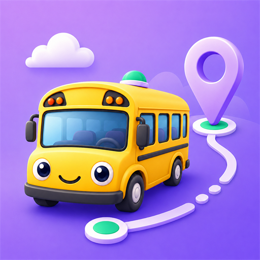
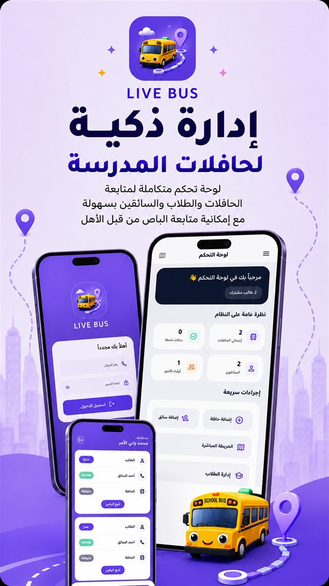
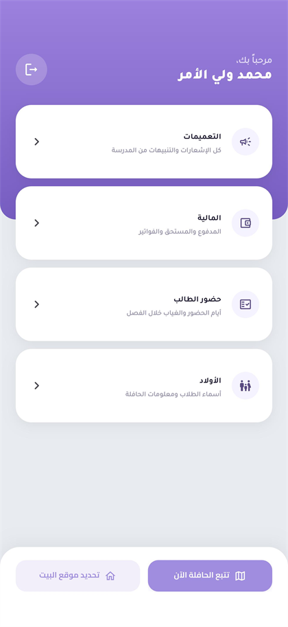
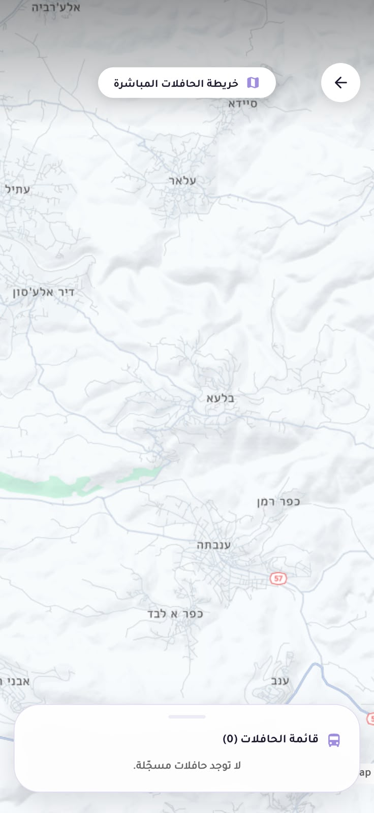
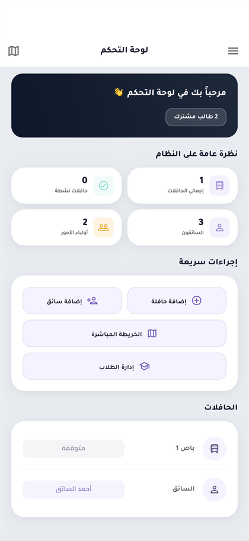
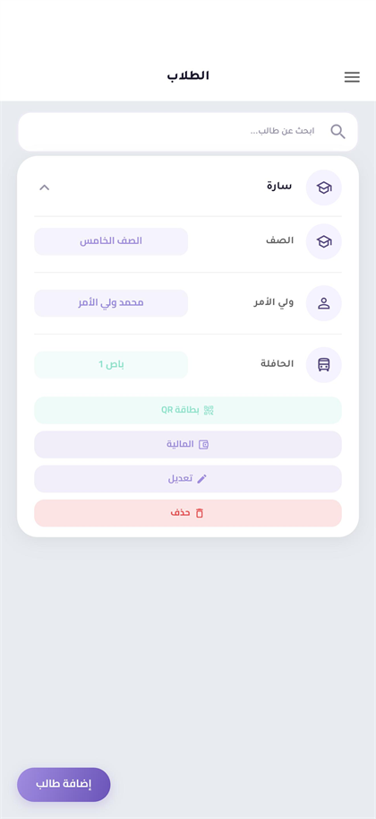
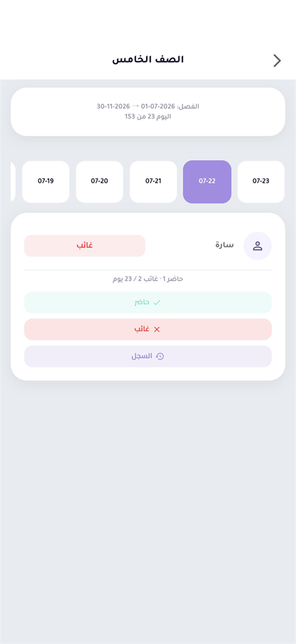
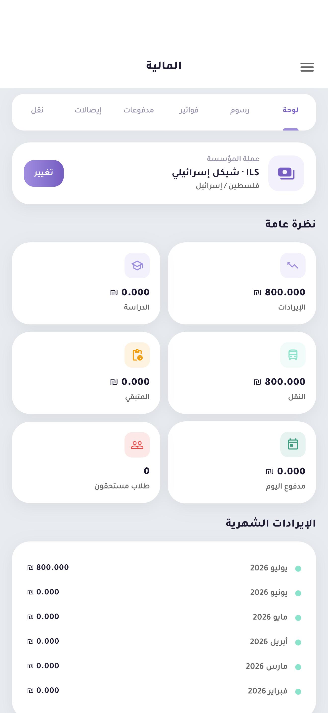

<div align="center">



# 🚍 Live Bus

**Complete School & Kindergarten Management Platform**

Real-time school transportation SaaS connecting schools, drivers, and parents — with administration, attendance, and finance in one system.

[](https://flutter.dev)
[](https://laravel.com)
[](https://firebase.google.com)
[](https://mysql.com)
[](#-architecture)

[Website](https://livebus.site) · [Product Overview](docs/PRODUCT_OVERVIEW.md) · [Architecture](docs/SYSTEM_ARCHITECTURE.md)



</div>

---

## Overview

Schools often manage transportation, attendance, finance, and communication with disconnected tools.

**Live Bus** brings everything together into one platform for:

🏫 School Administration · 🚌 Drivers · 👨‍👩‍👧 Parents · 🎓 Students

> **Not just bus tracking — a complete operating system for schools and kindergartens.**

---

## Why Live Bus?

Unlike traditional GPS tracking apps, Live Bus combines:

✅ School Administration  
✅ Student Management  
✅ Finance  
✅ Attendance  
✅ Real-time Transportation  
✅ Parent Communication  
✅ Multi-Tenant SaaS  

All within one scalable platform.

---

## Features

### School Administration

- Student & parent management
- Classes and attendance
- Bus & driver management
- Announcements
- Financial operations
- Reports and insights

### Student Management

- Student profiles and parent linking
- Class and bus assignment
- QR student cards
- Attendance history
- Financial records

### Smart Transportation

- Real-time bus tracking
- Live trip monitoring
- Route awareness
- Transportation subscriptions
- Parent notifications

### Parent Application

- View children
- Track buses live
- Notifications & announcements
- Attendance visibility
- Financial information
- Home location management

### Driver Application

- Start and manage trips
- Share live location
- View assigned students
- Record attendance
- Scan student QR codes

### Finance

- Fees, invoices, and payments
- Receipts and discounts
- Transportation subscriptions
- Financial summaries

---

## Tech Stack

| Layer | Technologies |
|-------|----------------|
| **Mobile** | Flutter, Dart |
| **Backend** | Laravel, PHP, REST APIs |
| **Database** | MySQL |
| **Real-time** | Firebase Realtime Database, FCM |
| **Maps** | HERE Maps |
| **Tools** | GitHub Actions, Docker, Linux |

---

## Architecture

```
             Flutter Applications
      Parent App | Driver App | Admin App
                     |
               Laravel Backend
         Auth · Business Logic · APIs
                     |
          ------------+------------
          |                       |
       MySQL              Firebase Realtime
    Primary data           Live tracking
```

Live GPS updates flow from drivers through Firebase to parents and admins. Organizational data is managed through the Laravel API and MySQL.

📖 Full details: **[docs/SYSTEM_ARCHITECTURE.md](docs/SYSTEM_ARCHITECTURE.md)**

---

## Screenshots

### Parent App

<p align="center">
  
  &nbsp;
  
</p>

### Driver App

<p align="center">
  
</p>

### Admin Dashboard

<p align="center">
  
  &nbsp;
  
</p>

<p align="center">
  
  &nbsp;
  
</p>

---

## Demo

🌐 **Website:** [https://livebus.site](https://livebus.site)

---

## Documentation

| Document | Description |
|----------|-------------|
| [Product Overview](docs/PRODUCT_OVERVIEW.md) | Problem, solution, audiences, and product areas |
| [System Architecture](docs/SYSTEM_ARCHITECTURE.md) | High-level architecture, roles, GPS flow, multi-tenant design |

---

## Project Highlights

✅ Multi-tenant SaaS architecture  
✅ Real-time GPS tracking  
✅ Multi-role mobile apps  
✅ School management system  
✅ Finance & attendance modules  
✅ Push notifications  
✅ Scalable backend design  

---

## Roadmap

- Advanced analytics
- AI-assisted route optimization
- Deeper automation
- Smart transportation insights
- Expanded school management modules

---

## About This Repository

This is a **public product showcase**. It contains documentation, architecture notes, and product screenshots only.

It does **not** include application source code, environment files, API keys, credentials, database dumps, or customer data.

---

## Author

**Amer Riad**  
Full Stack Developer

🌐 [livebus.site](https://livebus.site)  
💼 [LinkedIn](https://linkedin.com/in/amer-riad-73a67b277)  
📸 [Instagram](https://instagram.com/amer._.riad0)

---

⭐ If you enjoyed this project, consider giving it a star.
